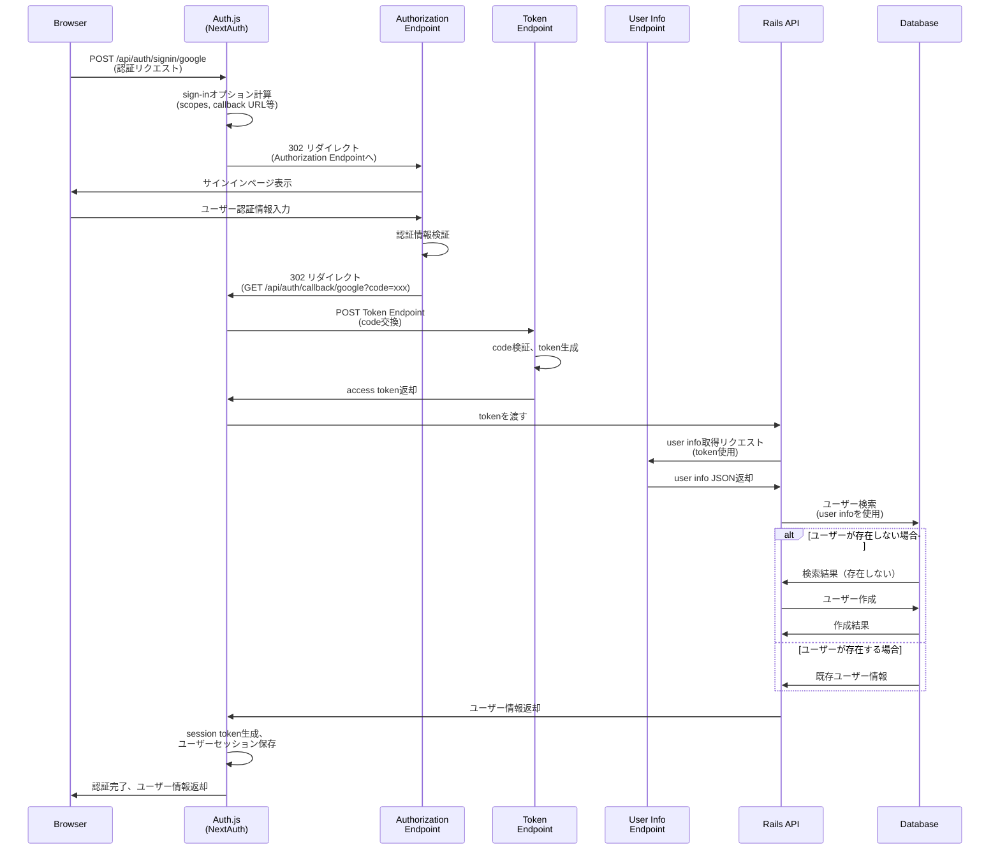

# まず何をするか

最初の認証。

next.js の front から route handler を叩く
route handler から rails の endpoint を叩く、
rails の endpoint から oauth が始まって、

と思ったけどどうなるんだ？
というのは rails の omniauth は front から api endpoint 叩くのはいいけど、

そもそも omniauth の仕組みから考えるか。
ええとまず rails の api endpoint 叩いたら勝手に redirect してくれるんだよな
そこから勝手にクライアントに返してくれるのかな？
やってみるか。

まず form 使って、指定の route handler へ叩くことができるかかな

まず、next.js から rails の omniauth endpoint を csrf token 添えて、叩く必要がある
post で。中で何しているかは知らないけど。

omniauth がどういうふうに認証しているかを知らないといけないのかな。

https://authjs.dev/getting-started/installation?framework=Next.js

結局 auth.js

まず、signin("google")をしたらどうなるのか

コードだったり doc を読み進めるとする

https://authjs.dev/concepts/oauth

手順
auth.js の signin("google")
route handler に post
post 先で redirect 302
idp 認証画面
成功したら callback
callback してから code 使って GET token endpoint
token をもらう
auth.js に帰ってきて、token を session に埋め込んで 最終的に app に帰る
この最終的な app の画面をどこで設定するか。
ここが分かれば、ここで token 使って rails の api に投げれば良い。
signin の{redirectTo: }で成功後のリダイレクト先を設定できる。
このあと、access_token、refresh_token を使用して、それらを rails に投げる必要がある。
route handler を経由して投げる必要がある

そのため、useeffect で routehandler に投げる必要がある

## 認証フロー（OIDC）

