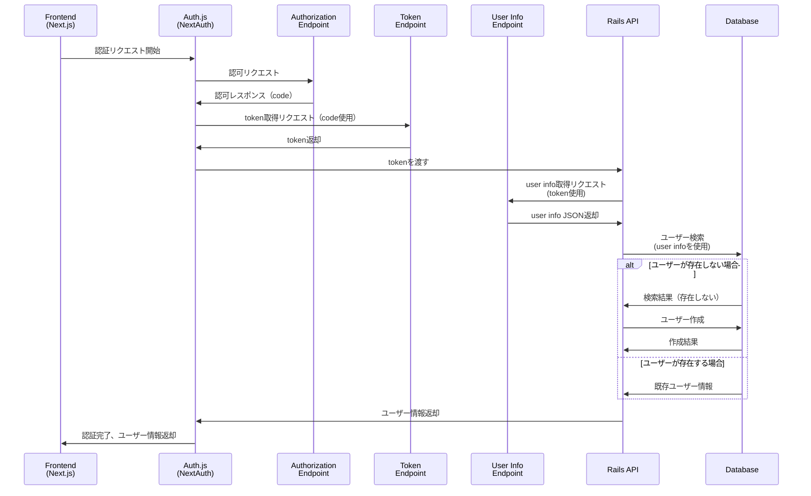

# まず何をするか

最初の認証。

next.js の front から route handler を叩く
route handler から rails の endpoint を叩く、
rails の endpoint から oauth が始まって、

と思ったけどどうなるんだ？
というのは rails の omniauth は front から api endpoint 叩くのはいいけど、

そもそも omniauth の仕組みから考えるか。
ええとまず rails の api endpoint 叩いたら勝手に redirect してくれるんだよな
そこから勝手にクライアントに返してくれるのかな？
やってみるか。

まず form 使って、指定の route handler へ叩くことができるかかな

まず、next.js から rails の omniauth endpoint を csrf token 添えて、叩く必要がある
post で。中で何しているかは知らないけど。

omniauth がどういうふうに認証しているかを知らないといけないのかな。

https://authjs.dev/getting-started/installation?framework=Next.js

結局 auth.js

## 認証フロー（OIDC）

