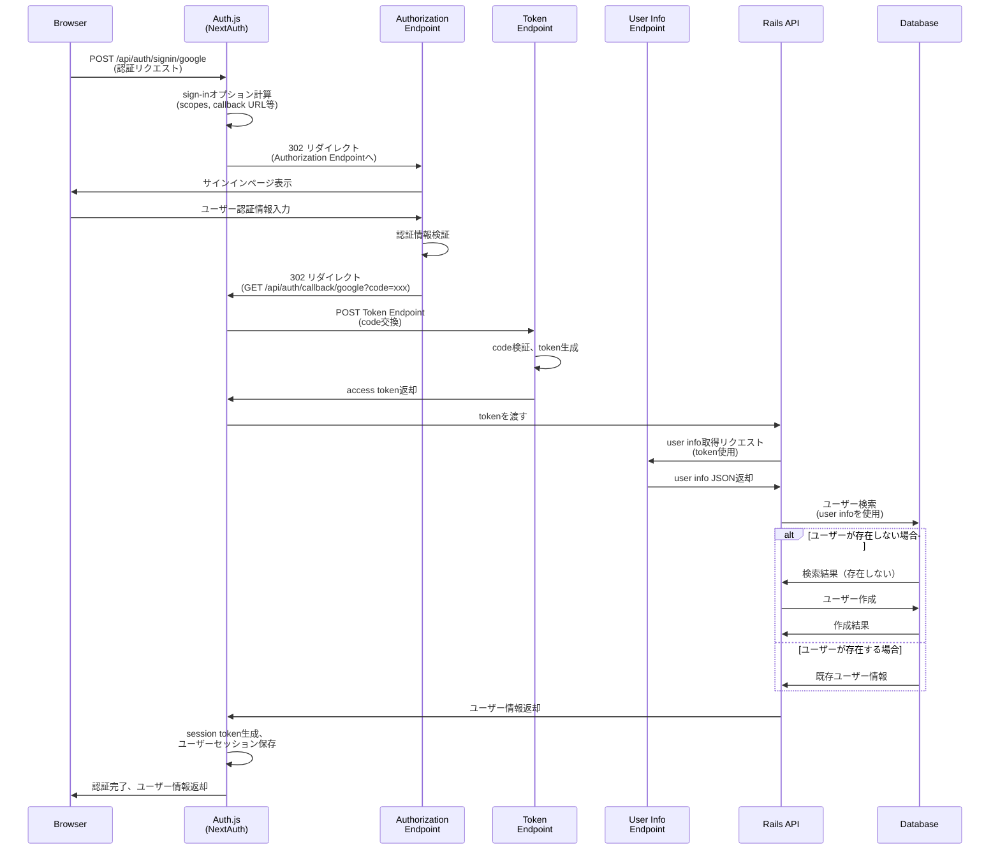

# まず何をするか

最初の認証。

next.js の front から route handler を叩く
route handler から rails の endpoint を叩く、
rails の endpoint から oauth が始まって、

と思ったけどどうなるんだ？
というのは rails の omniauth は front から api endpoint 叩くのはいいけど、

そもそも omniauth の仕組みから考えるか。
ええとまず rails の api endpoint 叩いたら勝手に redirect してくれるんだよな
そこから勝手にクライアントに返してくれるのかな？
やってみるか。

まず form 使って、指定の route handler へ叩くことができるかかな

まず、next.js から rails の omniauth endpoint を csrf token 添えて、叩く必要がある
post で。中で何しているかは知らないけど。

omniauth がどういうふうに認証しているかを知らないといけないのかな。

https://authjs.dev/getting-started/installation?framework=Next.js

結局 auth.js

まず、signin("google")をしたらどうなるのか

コードだったり doc を読み進めるとする

https://authjs.dev/concepts/oauth

手順
auth.js の signin("google")
route handler に post
post 先で redirect 302
idp 認証画面
成功したら callback
callback してから code 使って GET token endpoint
token をもらう
auth.js に帰ってきて、token を session に埋め込んで 最終的に app に帰る
この最終的な app の画面をどこで設定するか。
ここが分かれば、ここで token 使って rails の api に投げれば良い。
signin の{redirectTo: }で成功後のリダイレクト先を設定できる。
このあと、access_token、refresh_token を使用して、それらを rails に投げる必要がある。
route handler を経由して投げる必要がある

そのため、useeffect で routehandler に投げる必要がある

session に google の access_token を含めたいんだけどそれはどうやるんだろうか。

前提として、auth()の返り値である session object に signin で取得した基本情報が埋め込まれている
ここに情報を組み込むためにはどうすれば良いのだろうか。
https://authjs.dev/guides/extending-the-session
それがこれ。callbacks に指定する jwt や session はいつ役に立つのだろうか？
jwt と session の仕組みを知りたいな。よばれる順番
google の access_token とかってどこでもらえるのだろうか？

https://authjs.dev/guides/refresh-token-rotation
ここにヒントがありそう

callbacks で指定するそう。コード追うか、また。

NextAuth から始まる。
引数に指定できるのは NextAuthConfig。
これは function 指定することないからまぁ下の方で良い。

その返り値が handlers やら signin とかが返してくると。

今回知りたいのは signin の裏側で何をしているかということ。

そのため signin を掘り進めていく。

```
    signIn: (provider, options, authorizationParams) => {
      return signIn(provider, options, authorizationParams, config)
    },

```

あーで google-signin-form で使っている signin が実際に return しているのはこの上で行なっている signin の実行結果か。

じゃあこの中の signIn を見る必要があると。

まず最初の headers

headers is an async function that allows you to read the HTTP incoming request headers from a Server Component.

リクエストから request-header を取得して それを set する
option からも取得してセットする。

## 認証フロー（OIDC）



## route.ts でリクエストを受け取った後の処理フロー

`src/app/api/auth/[...nextauth]/route.ts` でリクエストを受け取った後、内部的にどのような処理が行われるかを詳しく説明します。

### 1. エントリーポイント: route.ts

```typescript
// src/app/api/auth/[...nextauth]/route.ts
import { handlers } from "@/lib/auth";
export const { GET, POST } = handlers;
```

- `handlers` は `NextAuth()` から返されるオブジェクト
- `GET` と `POST` の両方が同じ `httpHandler` 関数を参照
- すべてのリクエスト（`/api/auth/signin/google`, `/api/auth/callback/google` など）がこのハンドラーを通る

### 2. handlers の実装

```typescript
// next-auth/src/index.ts (409行目)
const httpHandler = (req: NextRequest) => Auth(reqWithEnvURL(req), config);
return {
  handlers: { GET: httpHandler, POST: httpHandler },
};
```

- `httpHandler` は `@auth/core` の `Auth()` 関数を呼び出す
- `reqWithEnvURL()` でリクエストに環境変数（`AUTH_URL` など）を設定

### 3. Auth() 関数の処理

```typescript
// @auth/core/src/index.ts (107行目)
const internalRequest = await toInternalRequest(request, config);
```

**toInternalRequest() の処理:**

- URL パスから `action` と `providerId` を解析
  - `/api/auth/callback/google` → `action: "callback"`, `providerId: "google"`
  - `/api/auth/signin/google` → `action: "signin"`, `providerId: "google"`
- リクエストボディ（JSON/フォーム）をパース
- クッキーをパース
- クエリパラメータを取得

### 4. AuthInternal() の処理

```typescript
// @auth/core/src/lib/index.ts (44-45行目)
case "callback":
  return await actions.callback(request, options, sessionStore, cookies)
```

- `action` に基づいて処理を分岐
- OAuth コールバックの場合は `actions.callback()` を実行

### 5. callback() 関数の詳細な処理フロー

#### 5-1. OAuth プロバイダーの判定

```typescript
// @auth/core/src/lib/actions/callback/index.ts (58行目)
if (provider.type === "oauth" || provider.type === "oidc") {
```

#### 5-2. handleOAuth() の呼び出し

```typescript
// @auth/core/src/lib/actions/callback/index.ts (83-87行目)
const authorizationResult = await handleOAuth(params, request.cookies, options);
```

**handleOAuth() 内の処理:**

1. **Authorization Server の設定取得**

   - Discovery エンドポイントから設定を取得（必要に応じて）
   - Token Endpoint と UserInfo Endpoint の URL を決定

2. **State パラメータの検証**

   ```typescript
   const state = await checks.state.use(cookies, resCookies, options);
   ```

   - クッキーから state を復元して検証
   - CSRF 攻撃を防止

3. **Authorization Code の検証**

   ```typescript
   codeGrantParams = o.validateAuthResponse(as, client, params, state);
   ```

   - OAuth プロバイダーから返された code パラメータを検証
   - state パラメータの一致を確認

4. **PKCE の検証**

   ```typescript
   const codeVerifier = await checks.pkce.use(cookies, resCookies, options);
   ```

   - クッキーから code_verifier を取得
   - セキュリティを強化

5. **Access Token の取得**

   ```typescript
   codeGrantResponse = await o.authorizationCodeGrantRequest(
     as,
     client,
     clientAuth,
     codeGrantParams,
     redirect_uri,
     codeVerifier
   );
   ```

   - Google の Token Endpoint に POST リクエスト
   - `code` を `access_token` と交換
   - レスポンスには `access_token`, `refresh_token`, `id_token` などが含まれる

6. **Token レスポンスの処理**

   ```typescript
   const processedCodeResponse = await o.processAuthorizationCodeResponse(...)
   ```

   - トークンレスポンスを検証・パース
   - ID Token の検証（OIDC の場合）

7. **UserInfo の取得**

   ```typescript
   // OIDC の場合、ID Token からプロファイルを取得
   if (requireIdToken) {
     profile = idTokenClaims
   } else {
     // OAuth2 の場合、UserInfo Endpoint から取得
     profile = await o.userInfoRequest(...)
   }
   ```

   - OIDC の場合: ID Token からユーザー情報を取得
   - OAuth2 の場合: UserInfo Endpoint にアクセストークンを使用してリクエスト

8. **プロファイルの変換**
   ```typescript
   profile = await provider.profile(profile, tokens);
   ```
   - プロバイダー固有の `profile()` コールバックでプロファイルを変換
   - 標準形式（`id`, `name`, `email`, `image` など）に変換

#### 5-3. ユーザー情報の取得結果

```typescript
// @auth/core/src/lib/actions/callback/index.ts (95-99行目)
const {
  user: userFromProvider,
  account,
  profile: OAuthProfile,
} = authorizationResult;
```

- `user`: ユーザー情報（id, name, email, image など）
- `account`: OAuth アカウント情報（providerAccountId, access_token, refresh_token など）
- `profile`: 元の OAuth プロファイルデータ

#### 5-4. 既存ユーザーの検索（アダプター使用時）

```typescript
// @auth/core/src/lib/actions/callback/index.ts (115-121行目)
if (adapter) {
  const { getUserByAccount } = adapter;
  userByAccount = await getUserByAccount({
    providerAccountId: account.providerAccountId,
    provider: provider.id,
  });
}
```

- データベースアダプターが設定されている場合、既存のアカウントを検索

#### 5-5. signIn コールバックの実行

```typescript
// @auth/core/src/lib/actions/callback/index.ts (123-130行目)
const redirect = await handleAuthorized(
  {
    user: userByAccount ?? userFromProvider,
    account,
    profile: OAuthProfile,
  },
  options
);
```

- `callbacks.signIn` を実行
- `false` を返すとアクセス拒否
- 文字列を返すとその URL にリダイレクト

#### 5-6. ログイン/登録処理

```typescript
// @auth/core/src/lib/actions/callback/index.ts (133-138行目)
const { user, session, isNewUser } = await handleLoginOrRegister(
  sessionStore.value,
  userFromProvider,
  account,
  options
);
```

**handleLoginOrRegister() の処理:**

1. **アダプター使用時**

   - 既存ユーザーを検索
   - 存在しない場合はユーザーを作成
   - アカウント情報をリンク
   - データベースセッションを作成

2. **JWT セッション戦略時**
   - ユーザー情報を返す（データベースには保存しない）

#### 5-7. JWT トークンの生成（JWT セッション戦略時）

```typescript
// @auth/core/src/lib/actions/callback/index.ts (140-172行目)
if (useJwtSession) {
  const defaultToken = {
    name: user.name,
    email: user.email,
    picture: user.image,
    sub: user.id?.toString(),
  };
  const token = await callbacks.jwt({
    token: defaultToken,
    user,
    account,
    profile: OAuthProfile,
    isNewUser,
    trigger: isNewUser ? "signUp" : "signIn",
  });

  // トークンを暗号化してクッキーに保存
  const newToken = await jwt.encode({ ...jwt, token, salt });
  const sessionCookies = sessionStore.chunk(newToken, {
    expires: cookieExpires,
  });
  cookies.push(...sessionCookies);
}
```

**重要なポイント:**

- `callbacks.jwt` がここで呼ばれる（サインイン時）
- デフォルトトークンに `account.access_token` などを追加できる
- 暗号化（JWE）されてクッキーに保存される

#### 5-8. イベントの発火

```typescript
// @auth/core/src/lib/actions/callback/index.ts (185-190行目)
await events.signIn?.({
  user,
  account,
  profile: OAuthProfile,
  isNewUser,
});
```

- `events.signIn` が呼ばれる（ログ記録などに使用）

#### 5-9. リダイレクト

```typescript
// @auth/core/src/lib/actions/callback/index.ts (195-204行目)
if (isNewUser && pages.newUser) {
  return {
    redirect: `${pages.newUser}?${new URLSearchParams({ callbackUrl })}`,
    cookies,
  };
}

return { redirect: callbackUrl, cookies };
```

- 新規ユーザーで `pages.newUser` が設定されている場合、そこへリダイレクト
- それ以外は `callbackUrl`（`signIn()` の `redirectTo` オプションで指定）へリダイレクト

### 6. レスポンスの返却

```typescript
// @auth/core/src/lib/utils/web.ts (74-96行目)
export function toResponse(res: ResponseInternal): Response {
  // クッキーを Set-Cookie ヘッダーに設定
  res.cookies?.forEach((cookie) => {
    headers.append("Set-Cookie", serializeCookie(...))
  })

  // リダイレクトの場合は Location ヘッダーを設定
  if (res.redirect) {
    response.headers.set("Location", res.redirect)
    status = 302
  }

  return response
}
```

- セッションクッキーが `Set-Cookie` ヘッダーに設定される
- リダイレクトの場合は `Location` ヘッダーが設定される
- ステータスコード 302 でリダイレクト

### 7. セッション取得時の処理フロー

`/api/auth/session` エンドポイントまたは `auth()` 関数でセッションを取得する場合：

#### 7-1. session() 関数の呼び出し

```typescript
// @auth/core/src/lib/actions/session.ts
export async function session(
  options,
  sessionStore,
  cookies,
  isUpdate,
  newSession
);
```

#### 7-2. JWT セッション戦略の場合

1. **JWT のデコード**

   ```typescript
   const payload = await jwt.decode({ ...jwt, token: sessionToken, salt });
   ```

2. **jwt コールバックの実行**

   ```typescript
   const token = await callbacks.jwt({
     token: payload,
     ...(isUpdate && { trigger: "update" }),
     session: newSession,
   });
   ```

   - セッション取得時にも `callbacks.jwt` が呼ばれる
   - `trigger: "update"` の場合はセッション更新時

3. **session コールバックの実行**

   ```typescript
   const newSession = await callbacks.session({ session, token });
   ```

   - クライアントに返すセッションオブジェクトを構築
   - JWT トークンの内容をセッションオブジェクトに反映

4. **クッキーの更新**
   ```typescript
   const newToken = await jwt.encode({ ...jwt, token, salt });
   const sessionCookies = sessionStore.chunk(newToken, { expires: newExpires });
   ```
   - トークンが更新された場合、クッキーも更新

#### 7-3. データベースセッション戦略の場合

1. **データベースからセッション取得**

   ```typescript
   const { user, session } = await getSessionAndUser(sessionToken);
   ```

2. **セッションの有効期限チェック**

   - 期限切れの場合は削除

3. **session コールバックの実行**
   ```typescript
   const sessionPayload = await callbacks.session({
     session: { ...session, user },
     user,
     newSession,
   });
   ```

### まとめ: callbacks の呼び出しタイミング

| コールバック        | 呼び出しタイミング                                            | 取得できる情報                                                                                      |
| ------------------- | ------------------------------------------------------------- | --------------------------------------------------------------------------------------------------- |
| `callbacks.jwt`     | 1. サインイン時<br>2. セッション取得時<br>3. セッション更新時 | サインイン時: `user`, `account`, `profile`<br>取得時: 既存のトークン<br>更新時: `trigger: "update"` |
| `callbacks.session` | 1. セッション取得時のみ                                       | JWT 戦略: `session`, `token`<br>DB 戦略: `session`, `user`                                          |

### コードパスまとめ

```
route.ts (GET/POST)
  ↓
handlers.GET/POST (httpHandler)
  ↓
Auth() (@auth/core)
  ↓
toInternalRequest() - URL解析、action決定
  ↓
AuthInternal()
  ↓
switch (action)
  case "callback":
    ↓
    actions.callback()
      ↓
      handleOAuth() - code交換、token取得、profile取得
      ↓
      handleLoginOrRegister() - ユーザー登録/ログイン
      ↓
      callbacks.jwt() - JWTトークン生成
      ↓
      jwt.encode() - トークン暗号化
      ↓
      cookies.push() - クッキーに保存
      ↓
      events.signIn() - イベント発火
      ↓
      return { redirect, cookies }
      ↓
toResponse() - レスポンス生成
  ↓
Response (302 Redirect + Set-Cookie)
```
